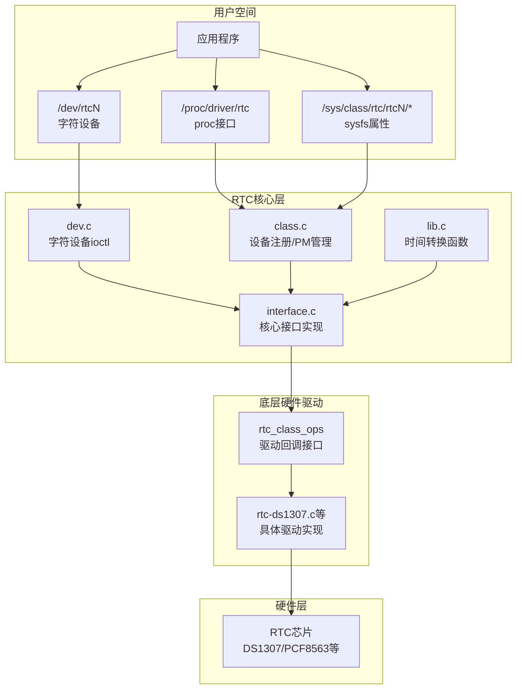
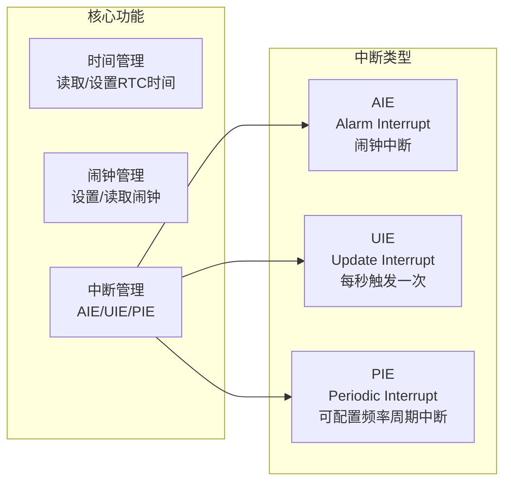
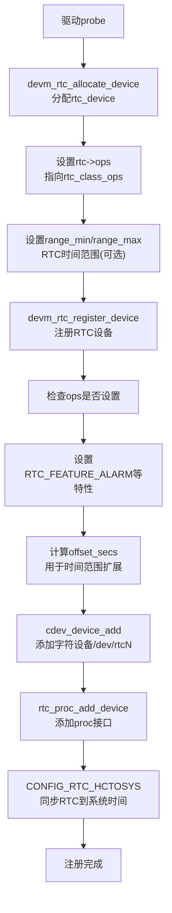
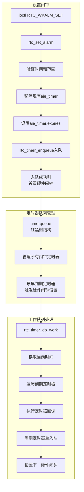
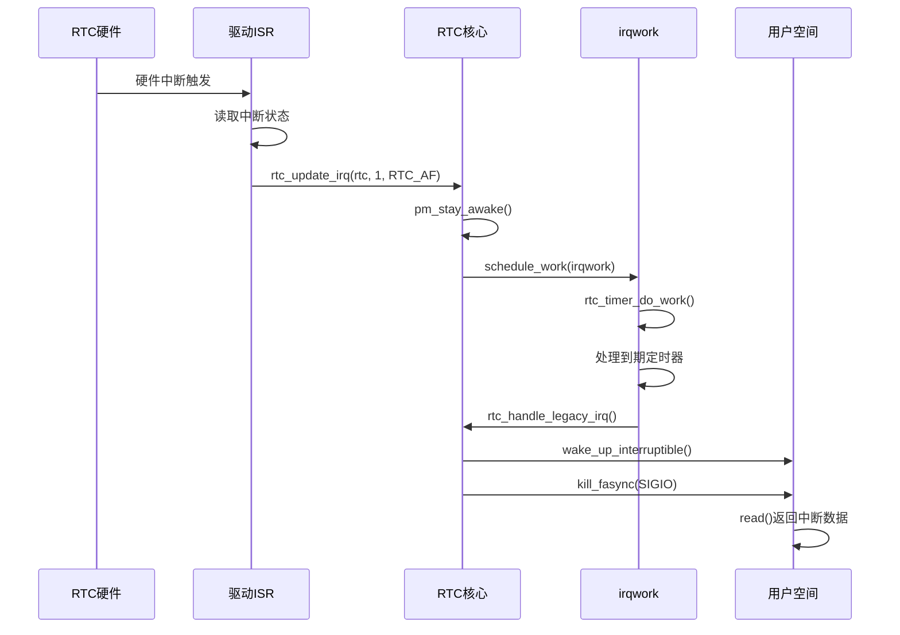
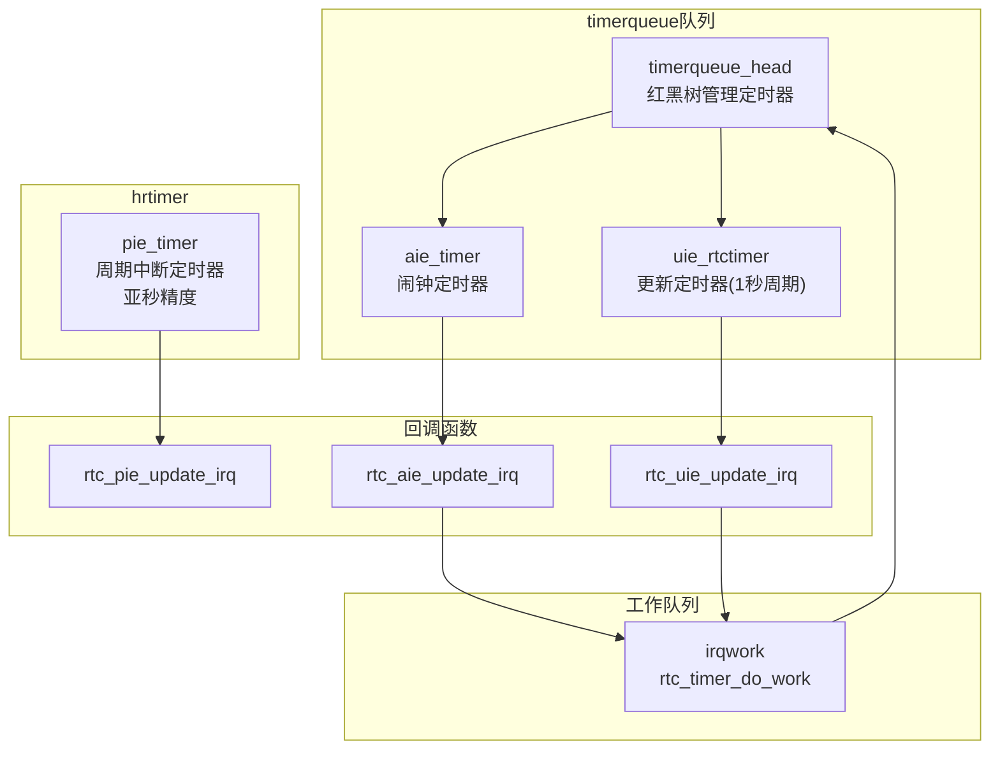

# Linux内核RTC驱动框架分析

## 1. RTC整体模块功能分析

### 1.1 架构层次框图



### 1.2 核心功能模块



### 1.3 RTC设备注册流程



---

## 2. RTC对驱动提供的接口功能

### 2.1 rtc_class_ops 回调接口

驱动通过实现 `struct rtc_class_ops` 向RTC核心层注册操作回调：

```c
struct rtc_class_ops {
    int (*ioctl)(struct device *dev, unsigned int cmd, unsigned long arg);
    int (*read_time)(struct device *dev, struct rtc_time *tm);
    int (*set_time)(struct device *dev, struct rtc_time *tm);
    int (*read_alarm)(struct device *dev, struct rtc_wkalrm *alarm);
    int (*set_alarm)(struct device *dev, struct rtc_wkalrm *alarm);
    int (*proc)(struct device *dev, struct seq_file *seq);
    int (*alarm_irq_enable)(struct device *dev, unsigned int enabled);
    int (*read_offset)(struct device *dev, long *offset);
    int (*set_offset)(struct device *dev, long offset);
    int (*param_get)(struct device *dev, struct rtc_param *param);
    int (*param_set)(struct device *dev, struct rtc_param *param);
};
```

### 2.2 接口函数详细说明

#### read_time - 读取RTC时间

```c
int (*read_time)(struct device *dev, struct rtc_time *tm);
```

| 参数 | 说明 |
|------|------|
| dev | RTC设备的父设备（I2C/Platform等总线设备） |
| tm | 返回的时间结构，需驱动从硬件寄存器填充 |

**返回值**：成功返回0，失败返回负错误码

**实现要点**：
- 从RTC硬件寄存器读取时间数据
- 转换为struct rtc_time格式（年从1900计数，月从0计数）
- 建议驱动内部做基本有效性检查

---

#### set_time - 设置RTC时间

```c
int (*set_time)(struct device *dev, struct rtc_time *tm);
```

| 参数 | 说明 |
|------|------|
| dev | RTC设备的父设备 |
| tm | 要设置的时间结构 |

**返回值**：成功返回0，失败返回负错误码

**实现要点**：
- 将struct rtc_time转换为硬件寄存器格式写入
- 注意闰年和月份天数处理

---

#### read_alarm - 读取硬件闹钟

```c
int (*read_alarm)(struct device *dev, struct rtc_wkalrm *alarm);
```

| 参数 | 说明 |
|------|------|
| dev | RTC设备的父设备 |
| alarm | 返回的闹钟结构，包含时间和使能状态 |

**返回值**：成功返回0，失败返回负错误码

**实现要点**：
- 部分RTC不支持日期字段，可返回-1作为"通配符"
- alarm->enabled表示闹钟是否使能

---

#### set_alarm - 设置硬件闹钟

```c
int (*set_alarm)(struct device *dev, struct rtc_wkalrm *alarm);
```

| 参数 | 说明 |
|------|------|
| dev | RTC设备的父设备 |
| alarm | 要设置的闹钟结构 |

**返回值**：成功返回0，失败返回负错误码

**实现要点**：
- 将闹钟时间和使能状态写入硬件
- 核心层已验证时间不在过去

---

#### alarm_irq_enable - 闹钟中断使能

```c
int (*alarm_irq_enable)(struct device *dev, unsigned int enabled);
```

| 参数 | 说明 |
|------|------|
| dev | RTC设备的父设备 |
| enabled | 1使能中断，0禁用中断 |

**返回值**：成功返回0，失败返回负错误码

---

#### read_offset - 读取时钟偏移

```c
int (*read_offset)(struct device *dev, long *offset);
```

| 参数 | 说明 |
|------|------|
| dev | RTC设备的父设备 |
| offset | 返回偏移值，单位ppb(parts per billion) |

**返回值**：成功返回0，不支持返回-EINVAL

**用途**：读取RTC晶振的校准偏移值，用于补偿晶振偏差

---

#### set_offset - 设置时钟偏移

```c
int (*set_offset)(struct device *dev, long offset);
```

| 参数 | 说明 |
|------|------|
| dev | RTC设备的父设备 |
| offset | 偏移值，单位ppb |

**返回值**：成功返回0，不支持返回-EINVAL

**计算公式**：`实际时间 = t0 * (1 + offset * 1e-9)`

---

#### ioctl - 自定义ioctl处理

```c
int (*ioctl)(struct device *dev, unsigned int cmd, unsigned long arg);
```

| 参数 | 说明 |
|------|------|
| dev | RTC设备的父设备 |
| cmd | ioctl命令号 |
| arg | ioctl参数 |

**返回值**：成功返回0，不支持的命令返回-ENOIOCTLCMD

**用途**：处理驱动特有的ioctl命令，核心层会先处理标准命令

---

#### proc - proc接口输出

```c
int (*proc)(struct device *dev, struct seq_file *seq);
```

| 参数 | 说明 |
|------|------|
| dev | RTC设备的父设备 |
| seq | seq_file用于输出 |

**返回值**：成功返回0

**用途**：向/proc/driver/rtc输出驱动特定信息

---

### 2.3 动调用核心层的接口

#### rtc_update_irq - 中断上报

```c
void rtc_update_irq(struct rtc_device *rtc, unsigned long num, unsigned long events);
```

| 参数 | 说明 |
|------|------|
| rtc | RTC设备指针 |
| num | 中断发生次数（通常为1） |
| events | 中断类型标志：RTC_AF/RTC_UF/RTC_PF组合 |

**调用时机**：驱动ISR中，当硬件中断触发时调用

---

## 3. 具体实现逻辑

### 3.1 时间读写流程


### 3.2 闹钟管理流程



### 3.3 中断处理流程



### 3.4 定时器系统架构



---

## 4. 用户态接口使用方式

### 4.1 用户态访问接口

RTC子系统为用户空间提供三种访问方式：

| 接口 | 路径 | 用途 |
|------|------|------|
| **字符设备** | `/dev/rtcN` | ioctl控制、read等待中断、poll监控 |
| **sysfs属性** | `/sys/class/rtc/rtcN/` | 读取时间、闹钟、属性信息 |
| **proc接口** | `/proc/driver/rtc` | 查看RTC信息（仅rtc0） |

### 4.2 字符设备 ioctl 命令详解

#### 时间读写命令

| 命令 | 功能 | 参数类型 | 权限要求 |
|------|------|----------|----------|
| `RTC_RD_TIME` | 读取RTC时间 | `struct rtc_time` | 无特殊权限 |
| `RTC_SET_TIME` | 设置RTC时间 | `struct rtc_time` | CAP_SYS_TIME |

**struct rtc_time 结构**：
```c
struct rtc_time {
    int tm_sec;   /* 秒 (0-59) */
    int tm_min;   /* 分 (0-59) */
    int tm_hour;  /* 时 (0-23) */
    int tm_mday;  /* 日 (1-31) */
    int tm_mon;   /* 月 (0-11) */
    int tm_year;  /* 年 (从1900起) */
    int tm_wday;  /* 星期 (0-6) */
    int tm_yday;  /* 年内天数 (0-365) */
    int tm_isdst; /* 夏令时 (-1未知) */
};
```

---

#### 闹钟命令（旧接口，24小时内）

| 命令 | 功能 | 参数类型 | 说明 |
|------|------|----------|------|
| `RTC_ALM_READ` | 读取闹钟时间 | `struct rtc_time` | 仅读取时间部分 |
| `RTC_ALM_SET` | 设置闹钟时间 | `struct rtc_time` | 仅设置时间，24小时内生效 |
| `RTC_AIE_ON` | 使能闹钟中断 | 无参数 | 开始监听闹钟中断 |
| `RTC_AIE_OFF` | 禁用闹钟中断 | 无参数 | 停止监听闹钟中断 |

**限制**：旧接口只能设置24小时内的闹钟，不支持完整日期。

---

#### 闹钟命令（新接口，完整日期）

| 命令 | 功能 | 参数类型 | 权限要求 |
|------|------|----------|----------|
| `RTC_WKALM_RD` | 读取完整闹钟 | `struct rtc_wkalrm` | 无特殊权限 |
| `RTC_WKALM_SET` | 设置完整闹钟 | `struct rtc_wkalrm` | 无特殊权限 |

**struct rtc_wkalrm 结构**：
```c
struct rtc_wkalrm {
    unsigned char enabled;  /* 闹钟使能状态 */
    unsigned char pending;  /* 闹钟待处理状态 */
    struct rtc_time time;   /* 闹钟时间 */
};
```

---

#### 更新中断命令（UIE）

| 命令 | 功能 | 参数 | 说明 |
|------|------|------|------|
| `RTC_UIE_ON` | 使能更新中断 | 无 | 每秒触发一次中断 |
| `RTC_UIE_OFF` | 禁用更新中断 | 无 | 停止每秒中断 |

**用途**：用于监测秒变化，实现精确时间同步。

---

#### 周期中断命令（PIE）

| 命令 | 功能 | 参数类型 | 说明 |
|------|------|----------|------|
| `RTC_IRQP_READ` | 读取中断频率 | `unsigned long` | 返回当前频率 |
| `RTC_IRQP_SET` | 设置中断频率 | `unsigned long` | 频率范围1-8192Hz，需要CAP_SYS_RESOURCE |
| `RTC_PIE_ON` | 使能周期中断 | 无参数 | 开始周期中断 |
| `RTC_PIE_OFF` | 禁用周期中断 | 无参数 | 停止周期中断 |

---

#### 参数命令（新接口）

| 命令 | 功能 | 参数类型 |
|------|------|----------|
| `RTC_PARAM_GET` | 获取RTC参数 | `struct rtc_param` |
| `RTC_PARAM_SET` | 设置RTC参数 | `struct rtc_param` |

**struct rtc_param 结构**：
```c
struct rtc_param {
    __u64 param;     /* 参数类型 */
    __u64 index;     /* 参数索引 */
    __u64 uvalue;    /* 无符号值 */
    __s64 svalue;    /* 有符号值 */
};
```

**参数类型**：
- `RTC_PARAM_FEATURES`：RTC特性位图
- `RTC_PARAM_CORRECTION`：时钟偏移校正值（ppb）

---

### 4.3 read() 使用方式

当用户调用 `read()` 时，会阻塞等待RTC中断发生：

```c
ssize_t read(int fd, void *buf, size_t count);
```

**返回数据格式**：
- `unsigned long` 或 `unsigned int` 类型数据
- 数据格式：`(中断计数 << 8) | RTC_IRQF | 中断类型`

**中断类型标志**：
- `RTC_AF (0x01)`：闹钟中断
- `RTC_UF (0x02)`：更新中断
- `RTC_PF (0x04)`：周期中断
- `RTC_IRQF (0x80)`：中断发生标志

**使用示例**：
```c
unsigned long data;
read(fd, &data, sizeof(data));

if (data & RTC_IRQF) {
    int count = (data >> 8);      /* 中断计数 */
    int type = data & 0xff;       /* 中断类型 */
    
    if (type & RTC_AF) {
        printf("闹钟中断发生，次数: %d\n", count);
    }
    if (type & RTC_UF) {
        printf("更新中断发生\n");
    }
    if (type & RTC_PF) {
        printf("周期中断发生，次数: %d\n", count);
    }
}
```

---

### 4.4 poll/select 使用方式

用户可以使用 `poll()` 或 `select()` 监控RTC中断：

```c
struct pollfd pfd;
pfd.fd = fd;
pfd.events = POLLIN;

int ret = poll(&pfd, 1, timeout);
if (ret > 0 && pfd.revents & POLLIN) {
    /* 有中断发生，可以read() */
    unsigned long data;
    read(fd, &data, sizeof(data));
}
```

---

### 4.5 完整用户态示例代码

#### 示例1：读取和设置RTC时间

```c
#include <stdio.h>
#include <fcntl.h>
#include <unistd.h>
#include <sys/ioctl.h>
#include <linux/rtc.h>

int main(void)
{
    int fd = open("/dev/rtc0", O_RDWR);
    if (fd < 0) {
        perror("open");
        return 1;
    }
    
    /* 读取时间 */
    struct rtc_time tm;
    if (ioctl(fd, RTC_RD_TIME, &tm) < 0) {
        perror("ioctl RTC_RD_TIME");
        close(fd);
        return 1;
    }
    
    printf("当前RTC时间: %d-%02d-%02d %02d:%02d:%02d\n",
           tm.tm_year + 1900, tm.tm_mon + 1, tm.tm_mday,
           tm.tm_hour, tm.tm_min, tm.tm_sec);
    
    /* 设置时间（需要root权限） */
    tm.tm_hour = 12;
    tm.tm_min = 0;
    tm.tm_sec = 0;
    
    if (ioctl(fd, RTC_SET_TIME, &tm) < 0) {
        perror("ioctl RTC_SET_TIME");
    }
    
    close(fd);
    return 0;
}
```

---

#### 示例2：设置闹钟并等待触发

```c
#include <stdio.h>
#include <fcntl.h>
#include <unistd.h>
#include <sys/ioctl.h>
#include <linux/rtc.h>
#include <signal.h>

int fd;

void alarm_handler(int sig)
{
    unsigned long data;
    read(fd, &data, sizeof(data));
    
    if (data & RTC_IRQF && data & RTC_AF) {
        printf("闹钟触发！\n");
    }
}

int main(void)
{
    fd = open("/dev/rtc0", O_RDWR);
    if (fd < 0) {
        perror("open");
        return 1;
    }
    
    /* 读取当前时间 */
    struct rtc_time tm;
    ioctl(fd, RTC_RD_TIME, &tm);
    
    /* 设置闹钟为10秒后 */
    struct rtc_wkalrm alarm;
    alarm.enabled = 1;
    alarm.pending = 0;
    alarm.time = tm;
    alarm.time.tm_sec += 10;
    if (alarm.time.tm_sec >= 60) {
        alarm.time.tm_sec -= 60;
        alarm.time.tm_min++;
    }
    
    printf("设置闹钟: %02d:%02d:%02d\n",
           alarm.time.tm_hour, alarm.time.tm_min, alarm.time.tm_sec);
    
    if (ioctl(fd, RTC_WKALM_SET, &alarm) < 0) {
        perror("ioctl RTC_WKALM_SET");
        close(fd);
        return 1;
    }
    
    /* 设置信号处理 */
    signal(SIGIO, alarm_handler);
    fcntl(fd, F_SETOWN, getpid());
    fcntl(fd, F_SETFL, fcntl(fd, F_GETFL) | FASYNC);
    
    /* 等待闹钟 */
    printf("等待闹钟触发...\n");
    pause();
    
    /* 关闭闹钟 */
    ioctl(fd, RTC_AIE_OFF);
    close(fd);
    return 0;
}
```

---

#### 示例3：使用UIE监测秒变化

```c
#include <stdio.h>
#include <fcntl.h>
#include <unistd.h>
#include <sys/ioctl.h>
#include <linux/rtc.h>
#include <poll.h>

int main(void)
{
    int fd = open("/dev/rtc0", O_RDONLY);
    if (fd < 0) {
        perror("open");
        return 1;
    }
    
    /* 使能UIE */
    if (ioctl(fd, RTC_UIE_ON) < 0) {
        perror("ioctl RTC_UIE_ON");
        close(fd);
        return 1;
    }
    
    printf("监测秒变化（10次）:\n");
    
    struct pollfd pfd = {fd, POLLIN, 0};
    int count = 0;
    
    while (count < 10) {
        poll(&pfd, 1, -1);  /* 阻塞等待 */
        
        unsigned long data;
        read(fd, &data, sizeof(data));
        
        if (data & RTC_IRQF && data & RTC_UF) {
            struct rtc_time tm;
            ioctl(fd, RTC_RD_TIME, &tm);
            printf("秒变化: %02d秒\n", tm.tm_sec);
            count++;
        }
    }
    
    /* 禁用UIE */
    ioctl(fd, RTC_UIE_OFF);
    close(fd);
    return 0;
}
```

---

#### 示例4：使用PIE周期中断

```c
#include <stdio.h>
#include <fcntl.h>
#include <unistd.h>
#include <sys/ioctl.h>
#include <linux/rtc.h>

int main(void)
{
    int fd = open("/dev/rtc0", O_RDONLY);
    if (fd < 0) {
        perror("open");
        return 1;
    }
    
    /* 设置频率为4Hz（需要CAP_SYS_RESOURCE权限） */
    unsigned long freq = 4;
    if (ioctl(fd, RTC_IRQP_SET, freq) < 0) {
        perror("ioctl RTC_IRQP_SET");
        close(fd);
        return 1;
    }
    
    /* 使能PIE */
    if (ioctl(fd, RTC_PIE_ON) < 0) {
        perror("ioctl RTC_PIE_ON");
        close(fd);
        return 1;
    }
    
    printf("周期中断频率: %lu Hz，监测5秒...\n", freq);
    
    int total = 0;
    while (total < freq * 5) {
        unsigned long data;
        read(fd, &data, sizeof(data));
        
        if (data & RTC_IRQF && data & RTC_PF) {
            int count = data >> 8;
            total += count;
            printf("周期中断，累计: %d\n", total);
        }
    }
    
    /* 禁用PIE */
    ioctl(fd, RTC_PIE_OFF);
    close(fd);
    return 0;
}
```

---

### 4.6 sysfs 属性接口

通过 `/sys/class/rtc/rtcN/` 可读取RTC状态：

| 属性文件 | 内容 |
|----------|------|
| `date` | 日期，格式 "YYYY-MM-DD" |
| `time` | 时间，格式 "HH:MM:SS" |
| `since_epoch` | 自1970以来的秒数 |
| `hctosys` | 是否用于系统时间同步（1/0） |
| `alarm` | 闹钟时间 |
| `wakealarm` | 用于系统唤醒的闹钟时间 |
| `max_user_freq` | 用户可设置的最大PIE频率 |
| `name` | RTC设备名称 |

**示例**：
```bash
# 查看RTC时间
cat /sys/class/rtc/rtc0/date
cat /sys/class/rtc/rtc0/time

# 查看闹钟
cat /sys/class/rtc/rtc0/alarm

# 设置唤醒闹钟（写入秒数）
echo +60 > /sys/class/rtc/rtc0/wakealarm  # 60秒后唤醒
```

---

### 4.7 proc 接口

通过 `/proc/driver/rtc` 查看 rtc0 信息：

```bash
cat /proc/driver/rtc
```

输出示例：
```
rtc_time        : 12:30:45
rtc_date        : 2024-01-15
alarm_time      : 13:00:00
alarm_date      : 2024-01-15
alarm_IRQ       : yes
UIE_IRQ         : no
PIE_IRQ         : no
24hr            : yes
```

---

## 5. 驱动开发要点

### 5.1 驱动实现最小要求

| RTC类型 | 必须实现 | 可选实现 |
|---------|----------|----------|
| 基本RTC | read_time, set_time | proc |
| 闹钟RTC | read_time, set_time, set_alarm, alarm_irq_enable | read_alarm |
| 高精度RTC | read_time, set_time, read_offset, set_offset | - |

### 5.2 驱动注册模板

```c
static const struct rtc_class_ops my_rtc_ops = {
    .read_time      = my_rtc_read_time,
    .set_time       = my_rtc_set_time,
    .set_alarm      = my_rtc_set_alarm,
    .alarm_irq_enable = my_rtc_alarm_irq_enable,
};

static int my_rtc_probe(struct platform_device *pdev)
{
    struct rtc_device *rtc;
    
    rtc = devm_rtc_allocate_device(&pdev->dev);
    if (IS_ERR(rtc))
        return PTR_ERR(rtc);
    
    rtc->ops = &my_rtc_ops;
    
    /* 设置时间范围（可选） */
    rtc->range_min = RTC_TIMESTAMP_BEGIN_2000;
    rtc->range_max = RTC_TIMESTAMP_END_2099;
    
    return devm_rtc_register_device(rtc);
}

/* 中断处理 */
static irqreturn_t my_rtc_irq(int irq, void *data)
{
    struct rtc_device *rtc = data;
    
    /* 检查中断类型 */
    int events = RTC_AF | RTC_IRQF;
    
    rtc_update_irq(rtc, 1, events);
    return IRQ_HANDLED;
}
```

### 5.3 注意事项

1. **ops_lock保护**：核心层已通过ops_lock保护，驱动内部也需适当保护硬件访问
2. **时间范围**：设置range_min/range_max可启用offset自动扩展机制
3. **闹钟精度**：如果只支持分钟级闹钟，设置 `RTC_FEATURE_ALARM_RES_MINUTE`
4. **中断上报**：ISR中调用 `rtc_update_irq()`，events需包含RTC_IRQF标志

---

## 6. 关键数据结构速查

### struct rtc_time
```c
struct rtc_time {
    int tm_sec;   /* 秒 0-59 */
    int tm_min;   /* 分 0-59 */
    int tm_hour;  /* 时 0-23 */
    int tm_mday;  /* 日 1-31 */
    int tm_mon;   /* 月 0-11 */
    int tm_year;  /* 年 - 1900 */
    int tm_wday;  /* 星期 0-6 */
    int tm_yday;  /* 年内天数 0-365 */
    int tm_isdst; /* 夏令时 */
};
```

### struct rtc_wkalrm
```c
struct rtc_wkalrm {
    unsigned char enabled;  /* 使能状态 */
    unsigned char pending;  /* 待处理状态 */
    struct rtc_time time;   /* 闹钟时间 */
};
```

### struct rtc_device (核心层内部)
```c
struct rtc_device {
    struct device dev;
    struct module *owner;
    int id;
    const struct rtc_class_ops *ops;
    struct mutex ops_lock;           /* 保护ops访问 */
    struct timerqueue_head timerqueue; /* 定时器队列 */
    struct rtc_timer aie_timer;      /* 闹钟定时器 */
    struct rtc_timer uie_rtctimer;   /* 更新定时器 */
    struct hrtimer pie_timer;        /* 周期定时器 */
    wait_queue_head_t irq_queue;     /* 等待队列 */
    unsigned long features;          /* 特性位图 */
    time64_t range_min, range_max;   /* 时间范围 */
    time64_t offset_secs;            /* 时间偏移 */
};
```

---

## 7. 相关文件路径

| 文件 | 路径 |
|------|------|
| RTC头文件 | `include/linux/rtc.h` |
| 用户API头文件 | `include/uapi/linux/rtc.h` |
| 设备注册 | `drivers/rtc/class.c` |
| 核心接口 | `drivers/rtc/interface.c` |
| 字符设备 | `drivers/rtc/dev.c` |
| 辅助函数 | `drivers/rtc/lib.c` |
| 内部头文件 | `drivers/rtc/rtc-core.h` |